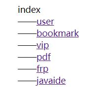
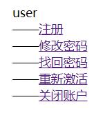
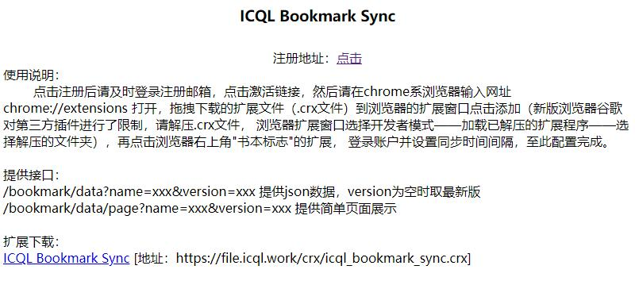
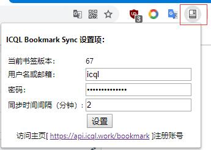
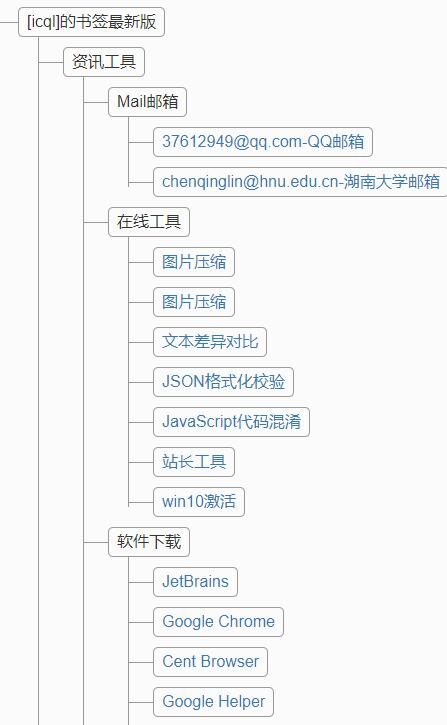
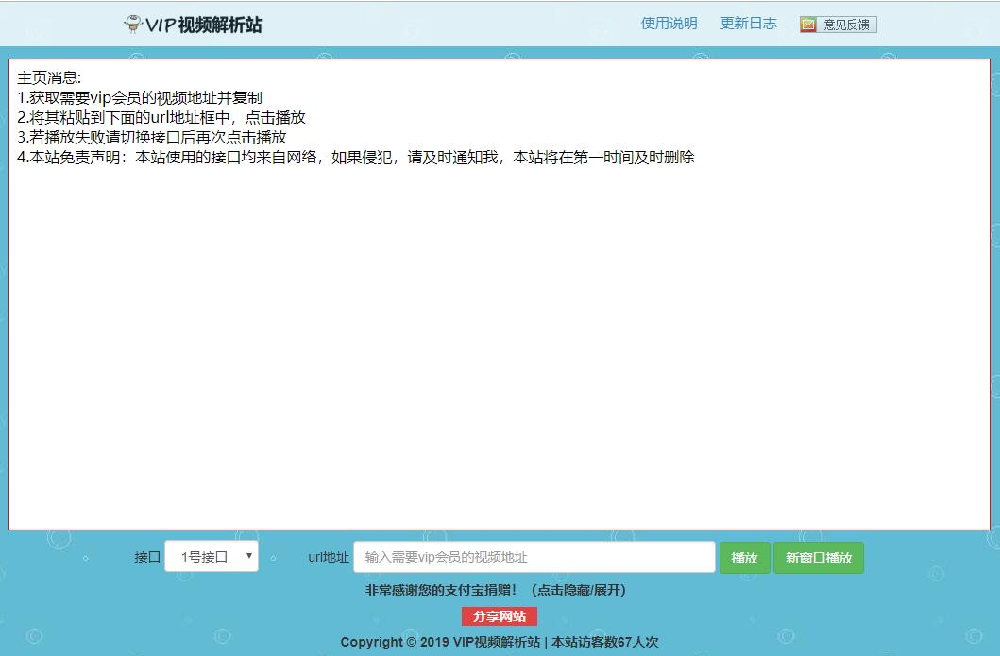
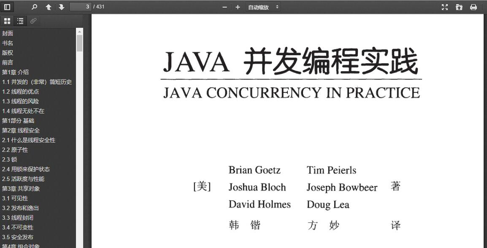
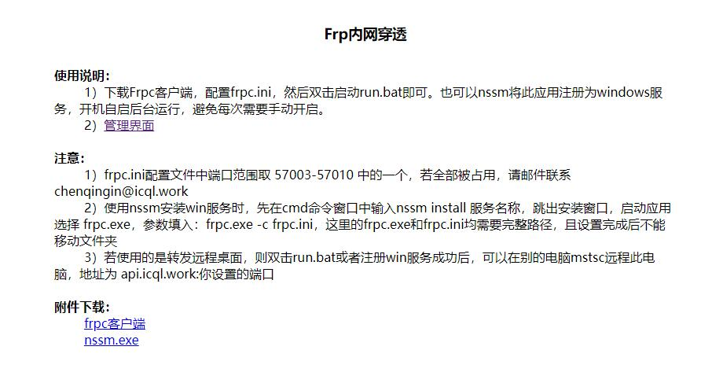

# api


### api服务
* 项目已迁移至新地址：https://gitee.com/icql/icql-cloud 和 https://github.com/icql/icql-cloud
* application-*.yml文件中的相关配置
    * 可以直接配置明文
    * 也可以使用Jasypt加密配置（在work.icql.api.config.JasyptConfig类中获取）
* 启动运行：参数配置 --spring.profiles.active=* 指定对应的配置文件，若使用Jasypt，则还需配置 --jasypt.encryptor.password=salt

``` shell
icql-api
    ├──user (用户相关)
    ├──auth (认证相关)
    ├──bookmark (chrome书签同步服务)
    ├──frp (内网穿透)
    ├──javaide (web版javaide//TODO)
    ├──pdf (web版pdf阅读器)
    ├──vip (vip视频解析)
```

### 截图展示
* api主界面

    
* user中心
    
    
* bookmark同步
    
    
* bookmark同步-插件

    
* bookmark同步-数据页面展示
    
    
* vip视频解析
    
    
* pdf阅读器
    
    
* frp内网穿透
    
    